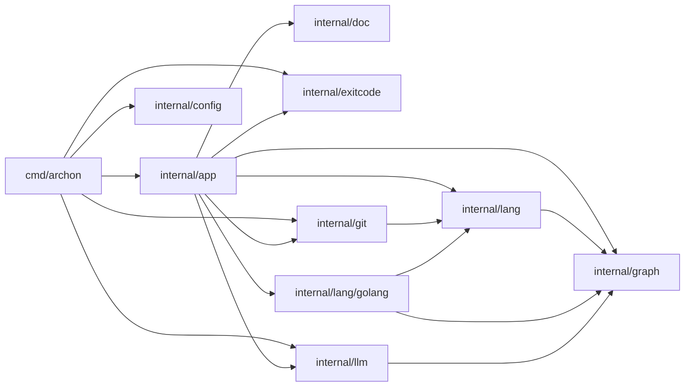

# Architecture

Archon keeps this diagram in sync with the first-party Go import graph.

<!-- ARCHON:START:data-flow -->

```mermaid
flowchart LR
  n_cmd_archon["cmd/archon"]
  n_internal_app["internal/app"]
  n_internal_config["internal/config"]
  n_internal_doc["internal/doc"]
  n_internal_exitcode["internal/exitcode"]
  n_internal_git["internal/git"]
  n_internal_graph["internal/graph"]
  n_internal_lang["internal/lang"]
  n_internal_lang_golang["internal/lang/golang"]
  n_internal_llm["internal/llm"]
  n_cmd_archon --> n_internal_app
  n_cmd_archon --> n_internal_config
  n_cmd_archon --> n_internal_exitcode
  n_cmd_archon --> n_internal_git
  n_cmd_archon --> n_internal_llm
  n_internal_app --> n_internal_doc
  n_internal_app --> n_internal_exitcode
  n_internal_app --> n_internal_git
  n_internal_app --> n_internal_graph
  n_internal_app --> n_internal_lang
  n_internal_app --> n_internal_lang_golang
  n_internal_app --> n_internal_llm
  n_internal_git --> n_internal_lang
  n_internal_lang --> n_internal_graph
  n_internal_lang_golang --> n_internal_graph
  n_internal_lang_golang --> n_internal_lang
  n_internal_llm --> n_internal_graph
```
<!-- ARCHON:END:data-flow -->
