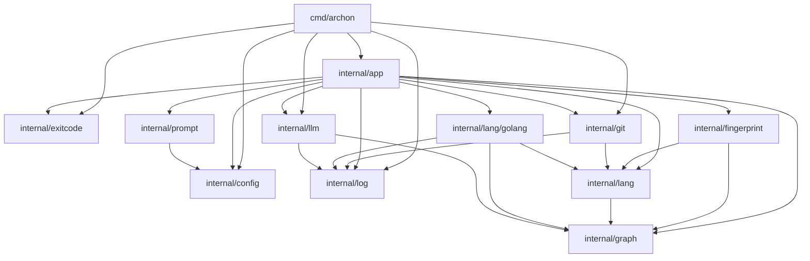

# Archon Architecture Documentation

Archon is a tool for tracking and generating documentation based on code structure changes and API evolution.

## System Diagram

## Package Overview

### `cmd/archon`
Entry point of the application. Handles CLI execution and error propagation.

### `internal/app`
Orchestrates core functionality including `Sync`, `Changelog`, `Check`, and `Diff` operations. Uses `App` struct to manage repository state, LLM integration, and configuration.

### `internal/config`
Manages application settings, generator definitions, and loading of configuration files.

### `internal/doc`
Provides utility functions for manipulating documentation files, specifically handling anchors and region replacements for automated updates.

### `internal/fingerprint`
Responsible for analyzing codebase state, generating structure hashes, and calculating diffs between API sets and dependency graphs to identify significant changes.

### `internal/git`
Wraps Git operations to interact with the repository, including history analysis, tagging, and snapshotting specific revisions for analysis.

### `internal/graph`
Defines the structure of the dependency graph and provides methods for generating reports and visualizing architecture via Mermaid diagrams.

### `internal/lang` & `internal/lang/golang`
Defines the extraction interfaces for analyzing source code. `golang` implements these for Go, providing structural extraction and API signature parsing.

### `internal/llm`
Handles communication with language models to generate documentation summaries and change descriptions based on structural diffs.

### `internal/prompt`
Manages templates for LLM interactions, loading custom prompts from the repository and rendering them with provided data context.
