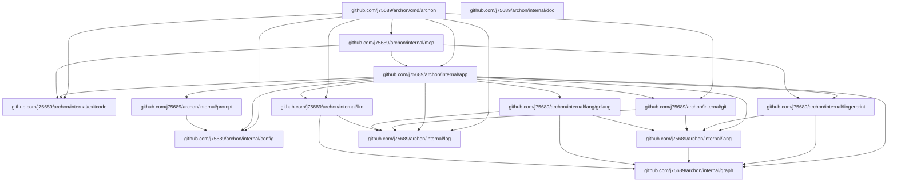

# Architecture

Archon is a modular tool designed for analyzing, documenting, and detecting drift in codebase structures and APIs. It leverages Git for version control snapshots, language-specific extractors to map graph dependencies and API signatures, and LLM-driven generation to provide insights or changelogs based on those structural differences.

## System Graph

## Key Components

### internal/app
This package serves as the central orchestrator, providing methods to compare code revisions, extract structural graphs and APIs, and manage synchronization tasks. It interfaces with Git for repository access and utilizes specialized extractors and LLM clients to process codebase changes.

### internal/fingerprint
This package is responsible for generating, comparing, and managing project fingerprints. It facilitates the creation of lockfiles that capture the state of a graph and its associated APIs, allowing for diffing and hash verification.

### internal/lang/golang
This package implements language-specific logic for Go projects. It provides the `Extractor` implementation to scan snapshots and resolve dependency graphs and exported API signatures.

### internal/mcp
This package provides the Model Context Protocol (MCP) server implementation for Archon. It enables external agents to interact with the application’s core logic through standardized transports, including HTTP handlers and stdio execution.

## API Reference

| Package | Key Exported Names |
| :--- | :--- |
| `cmd/archon` | `errExit` |
| `internal/app` | `App`, `New`, `Sync`, `Structure`, `Diff`, `Changelog` |
| `internal/config` | `Load`, `Values`, `Generator` |
| `internal/doc` | `ExtractRegion`, `ReplaceRegion`, `NewDocument`, `AppendAnchor` |
| `internal/exitcode` | `OK`, `Fail`, `Gate` |
| `internal/fingerprint` | `Lockfile`, `DiffAPIs`, `Hash`, `NewLockfile` |
| `internal/git` | `Repo`, `Open`, `Snapshot`, `LogSubjects`, `DescribeTag` |
| `internal/graph` | `Graph`, `Diff`, `RenderMermaid`, `DiffGraphs` |
| `internal/lang` | `Extractor`, `Snapshot`, `APISet` |
| `internal/lang/golang` | `Extractor`, `WantFile` |
| `internal/llm` | `Client`, `Complete`, `Delta` |
| `internal/log` | `Logger`, `Writer`, `Nop` |
| `internal/mcp` | `Server`, `New`, `RunStdio`, `HTTPHandler`, `Version` |
| `internal/prompt` | `Render`, `Load`, `BuiltIn` |

## Recent Changes

The `internal/mcp` package has been updated with new exported functions `NewHTTPServer` and `ServeHTTP` for HTTP-based server management, along with a new `Version` variable.
