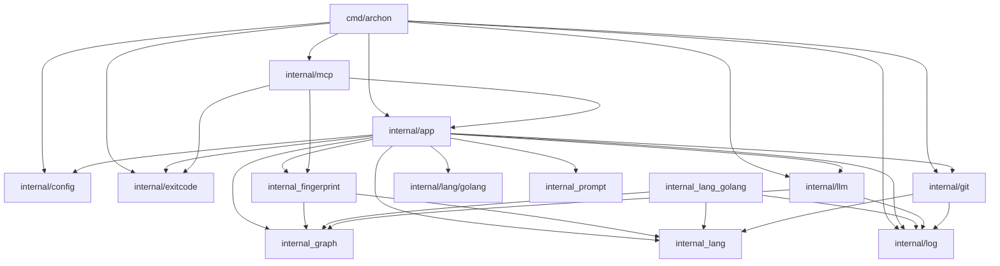

# Archon Documentation

Archon is a tool for tracking and analyzing the architecture of a Go project. It enables tracking project structures, identifying API changes across git revisions, and providing LLM-powered insights through a Model Context Protocol (MCP) server.

## System Architecture

## Key Components

### `internal/app`
The core engine that coordinates repository snapshots, extraction logic, and command execution (Sync, Diff, Structure).

### `internal/mcp`
Provides an interface for AI assistants to interact with the Archon engine. It supports remote connectivity and standard IO operation to perform architectural drift analysis.

### `internal/fingerprint`
Responsible for calculating hashes and identifying API/Graph diffs. It facilitates the `Lockfile` system to detect architectural drift between git commits.

### `internal/lang`
Defines the `Extractor` interface, allowing Archon to support multiple languages, with `internal/lang/golang` providing the primary implementation for Go analysis.

## API Reference Summary

| Package | Key Exports |
| :--- | :--- |
| **`internal/app`** | `New`, `Sync`, `Diff`, `Structure`, `FormatAPIs`, `FormatGraph` |
| **`internal/config`** | `Load`, `Values`, `Generator` |
| **`internal/graph`** | `DiffGraphs`, `RenderMermaid`, `Compile` |
| **`internal/fingerprint`** | `Hash`, `DiffAPIs`, `NewLockfile` |
| **`internal/llm`** | `Complete`, `Delta`, `Client` |
| **`internal/mcp`** | `New`, `Server`, `Connect`, `HTTPHandler` |

## Recent Changes
- Introduced `internal/mcp` package for external integration.
- Updated `internal/llm` client signature to include `Timeout`.
- Enhanced `internal/app` with `Structure`, `FormatAPIs`, and `FormatGraph` functions.
