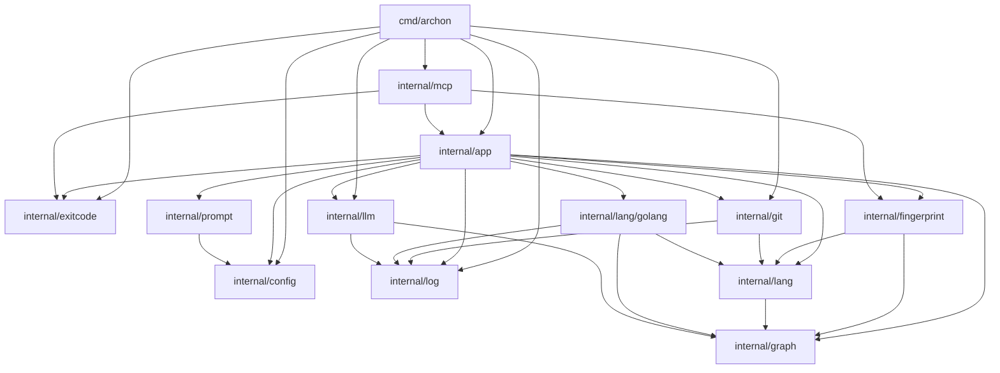

# Archon Documentation

Archon is a tool for tracking and documenting software architecture evolution through structural analysis of source code. It utilizes Git history, structural graph extraction, and LLM-powered changelog generation.

## Component Dependency Graph

## Core Modules

### `internal/app`
The orchestration layer. It manages the Git repository state and coordinates the extraction of graph structures and API signatures. Key features include:
- `Structure(rev)`: Extracts the full dependency graph and API set for a given revision.
- `Diff()`, `Sync()`, and `Changelog()`: Commands for comparing architecture states and generating documentation.

### `internal/mcp`
Provides the Model Context Protocol server interface. This allows external LLM agents to inspect the architecture of the repository directly via Archon's logic.
- `Server`: Wraps the `App` instance to expose structural data as tools.
- `Args`: Defines inputs for drift comparison (`From`, `To` revisions).

### `internal/fingerprint`
Responsible for stability checking. It defines the `Lockfile` format which stores the canonical representation of the repository's structure (`graph` and `APIs`) and its hash.

### `internal/lang`
Abstracts language-specific parsing. The `Extractor` interface allows adding new languages (currently `golang` is implemented) to perform source code analysis.

## Key Types

| Type | Description |
| :--- | :--- |
| `graph.Graph` | A collection of nodes and edges representing project structure. |
| `lang.APISet` | A list of packages and their exported signatures. |
| `config.Values` | Project-specific configuration for LLM integration and generators. |
| `fingerprint.Lockfile` | Persistence layer for architecture state snapshots. |

## Changelog Summary (Recent Changes)

*   **Added**: `internal/mcp` module for LLM-based tool integration.
*   **Added**: Integration between `cmd/archon` and `internal/mcp`.
*   **Updated**: `internal/llm.Client` now includes `Timeout` configuration.
*   **Added**: Enhanced reporting helpers `FormatAPIs` and `FormatGraph` in `internal/app`.
