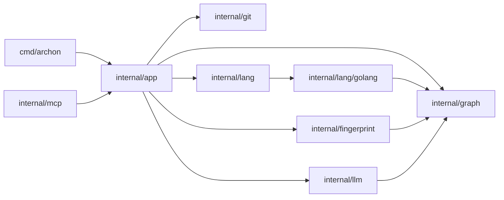

# Workflow

Archon operates as a codebase analysis and documentation tool that tracks structural changes in source code by comparing snapshots across different Git revisions. The system orchestrates code extraction using language-specific plugins, generates dependency graphs and API sets, and identifies differences between states. This data is processed through LLM integration or local documentation formatters to produce actionable insights, which can be served via CLI commands or an MCP (Model Context Protocol) server.

## Command / Data Flow

## Core Modules

* **`internal/app`**: Acts as the central orchestrator that provides the primary interface for repository analysis. It coordinates the extraction of graph and API data from Git snapshots, manages configuration, and facilitates synchronization, diffing, and structure generation.
* **`internal/mcp`**: Implements the Model Context Protocol server, allowing LLM clients to interface with the `App` instance. It provides HTTP and Stdio transport support to expose repository analysis capabilities remotely.
* **`internal/llm`**: Manages communication with external large language models. It handles task-specific completion requests and provides logic to generate descriptive "deltas" based on graph and code structural changes.

## Key Types

* **`app.App`**: The primary controller containing repository state, configuration, and interfaces for logging and LLM interaction.
* **`graph.Graph`**: A representation of the dependency structure, containing nodes and edges extracted from source code.
* **`lang.APISet`**: A collection of exported package APIs, including signatures and documentation, used for tracking functional changes.
* **`fingerprint.Lockfile`**: A serialized state containing the graph hash, dependency graph, and API set used to detect drift between Git revisions.
* **`config.Generator`**: Defines instructions for custom documentation generation tasks, including the prompt and target path.

## Changelog Summary

The following structural changes were detected in `internal/mcp`:
* Added `func NewHTTPServer(addr string, handler http.Handler) *http.Server`
* Added `func ServeHTTP(ctx context.Context, srv *http.Server) error`
* Added `var Version`
