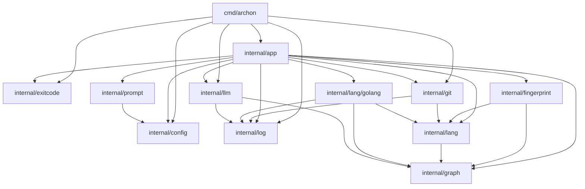

# Archon Architecture Documentation

Archon is a Go-based tool designed to manage project documentation by synchronizing code structure, API surfaces, and technical context using LLMs.

## Dependency Graph

## Core Modules

### `internal/app`
The orchestration layer. It exposes the primary CLI actions:
* `Changelog()`: Generates changelogs based on code evolution.
* `Check()`: Verifies if documentation is up to date with the code.
* `Diff()`: Reports structural changes in the codebase.
* `Sync()`: Synchronizes documentation blocks with code changes.

### `internal/fingerprint`
Handles the identification of code state using `Lockfile` structures. It provides hashing and diffing capabilities for both graphs and API sets to determine if documentation needs regeneration.

### `internal/lang` & `internal/lang/golang`
Provides the abstraction for code analysis. The `Extractor` interface allows Archon to support multiple languages, with a concrete implementation for Go that extracts dependency graphs and API signatures.

### `internal/llm`
Communicates with LLM providers to generate content based on the structured data provided by the graph and API extractors.

### `internal/doc`
A utility package for surgical manipulation of documentation files (e.g., Markdown), handling the injection and replacement of content within specific "anchor" regions.

## Data Structures

The system relies on three primary data pillars:
1. **Graph**: Represents package relationships and node dependencies.
2. **API Set**: Contains package-level definitions, documentation, and signatures.
3. **Prompt Data**: A composite structure passed to LLM templates containing:
    * `Graph`: The serialized dependency structure.
    * `APIs`: The serialized surface area of the code.
    * `Diff`: The detected structural changes between code versions.
